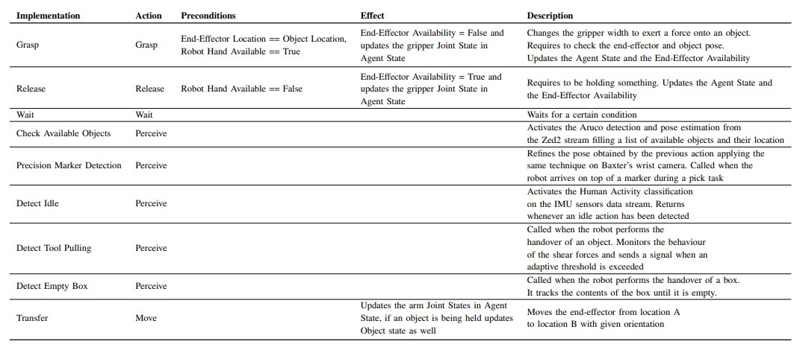

# A Modular Framework for Flexible Human-Robot Collaboration Planning  
## Abstract 
This project presents a comprehensive framework designed to enhance Human-Robot Collaboration (HRC) in real-world scenarios. The framework introduces a formalism for modeling articulated tasks that necessitate cooperation between two agents. It achieves this through a streamlined set of primitives. Our implementation leverages Hierarchical Task Networks (HTN) planning and a modular multisensory perception pipeline. This pipeline includes vision, human activity recognition, and tactile sensing. To showcase the scalability and adaptability of the system, we present a validation scenario. In this scenario, two humans take turns collaborating with the manufacturing robot Baxter to assemble four furniture pieces, each with variable components. The results of this validation scenario highlight the robustness and adaptability of our approach. This framework paves the way for the broader utilization of HRC in various domains and applications. 

## Authors  
- Valerio Belcamino 
- - Mariya Kilina 
- - Linda Lastrico 
- - Alessandro Carfì 
- - Fulvio Mastrogiovanni

## Planner, State and Actions
In the formalization of the collaborative assembly scenario, we have identified four state features that describe the interaction of agents with the environment. These features are end-effector availability (EEA), agent pose (AP), object pose (OP), and object characteristics (OC).
The following table describes the interplay of these state features with the actions that we selected:

* Description of the interplay of actions and state features. On the left are the preconditions that need to be met to
execute the actions; on the right are the state features (effects) that get updated after the given action. The symbol ‘V’ in
the Preconditions section means that a certain action requires the corresponding state variable to respect some constraints;
on the other side, the ‘X’ symbol means that the action and the feature are decoupled. As for the Effects, a ‘V’ means that
the state variable gets updated by the action, and the ‘X’ means that it does not. The symbol ‘?’ describes an action that
can update a feature only if some additional requirements are met. In this case, Move can update the Object Pose feature
only if End-Effector Availability was False when the action began.*

## Action Implementation

* Action implementations designed in our system. The first two columns refer to the implementation name and
the corresponding action among the six that we identified in the formalism section. The second and the third contain the
preconditions necessary to undertake each action and their effects on the state features. Lastly, we provide a brief description
of the logic of each function.*

## System Architecture

* Architecture diagram of the system. The HTN planner can activate the perception modules to update its state and
can move the robot using the Joint Trajectory Client. The perception module is composed of cameras, wearable and tactile
sensors. The vision has three different modules: Localize Multiple Markers to identify and estimate the positions of the
markers in the scene, Refine Marker Pose to improve the estimated position of a single marker before grasping, and Box
Handover Detection to detect handover of small components such as screws. The Wearables have been used to detect when
the human is idle and the Tactile sensing to automatize the handover of tools using the shear forces.*

## Repository Structure
Under htn_planner/scripts there are the scripts related to motion planning and the communication with Baxter and the main file called planner.py
Following the hierarchy, in Actions, Methods and State there is the implementation of the planned actions and state variable described above.
Additionally, in the tactile_perception submodule there is the driver for the Melexis tactile sensor and the logic developed for the handover of tools and in vision_perception there is the aruco marker estimation developed for both the Zed2 camera and for Baxter's cameras.
